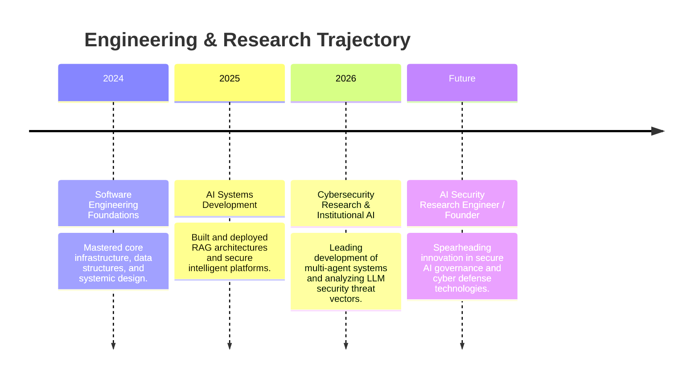

  

  <h3>AI Engineer | Cybersecurity Researcher | Full Stack Developer</h3>
  
  

    Researching and Engineering Secure AI Systems for Enterprise, Finance, and Cyber Defense.
  

  

    
    
  

 

---

## 🏛️ Executive Summary

I am a Software Engineer and Researcher operating at the intersection of **Artificial Intelligence** and **Cybersecurity**. My work is dedicated to architecting institutional-grade, multi-agent AI systems and ensuring these platforms are mathematically robust and practically secure against emerging threat vectors.

By combining a rigorous academic approach to machine learning with adversarial security paradigms, I build intelligent systems that solve complex analytical problems—from automated quantitative finance engines to secure legal RAG architectures. My long-term vision is to advance the secure integration of artificial intelligence into critical infrastructure, finance, and enterprise ecosystems.

---

## 🚀 Featured Projects

<table>
  <tr>
    <td width="50%" valign="top">
      <h3 align="center">🛡️ AI Security Intelligence Platform</h3>
      
A comprehensive threat intelligence and security operations platform designed to leverage AI for automated threat detection and incident response.

      <ul>
        <li><strong>Focus:</strong> Threat Detection, MITRE ATT&CK Mapping, Risk Assessment</li>
        <li><strong>Capabilities:</strong> Automated Reporting, SIEM Integration</li>
        <li><strong>Status:</strong> Active Development</li>
      </ul>
      

        <a href="https://github.com/3447-OFFICIAL/ai-security-platform"><b>View Repository ➔</b></a>
      

    </td>
    <td width="50%" valign="top">
      <h3 align="center">📈 AI Hedge Fund Simulator</h3>
      
An institutional-grade architecture simulating complex market dynamics, algorithmic trading strategies, and quantitative risk analytics.

      <ul>
        <li><strong>Focus:</strong> Institutional Finance, Risk Analytics</li>
        <li><strong>Architecture:</strong> Multi-Agent Systems (MARL), Portfolio Intelligence</li>
        <li><strong>Status:</strong> Stable Release</li>
      </ul>
      

        <a href="https://github.com/3447-OFFICIAL/ai-hedge-fund"><b>View Repository ➔</b></a>
      

    </td>
  </tr>
  <tr>
    <td width="50%" valign="top">
      <h3 align="center">📊 AI Equity Research Analyst</h3>
      
An advanced NLP pipeline designed to ingest and synthesize SEC filings and earnings transcripts into actionable financial models.

      <ul>
        <li><strong>Focus:</strong> Financial Intelligence, SEC Filing Analysis</li>
        <li><strong>Capabilities:</strong> Research Automation, NLP Pipelines</li>
        <li><strong>Status:</strong> Active Maintenance</li>
      </ul>
      

        <a href="https://github.com/3447-OFFICIAL/equity-research-analyst"><b>View Repository ➔</b></a>
      

    </td>
    <td width="50%" valign="top">
      <h3 align="center">⚖️ NyayaDraft</h3>
      
A specialized Legal AI assistant leveraging advanced retrieval to process complex Indian Kanoon databases for intelligent draft generation.

      <ul>
        <li><strong>Focus:</strong> Legal AI, Knowledge Retrieval</li>
        <li><strong>Innovation:</strong> Domain-Specific RAG Architecture</li>
        <li><strong>Status:</strong> Stable Release</li>
      </ul>
      

        <a href="https://github.com/3447-OFFICIAL/nyayadraft"><b>View Repository ➔</b></a>
      

    </td>
  </tr>
</table>

---

## 🔒 Cybersecurity Research & Security Engineering

My cybersecurity research focuses on the defense of intelligent systems and cloud infrastructure. I proactively analyze vulnerabilities at the nexus of traditional security and generative AI models.

**Core Research Areas:**
* Threat Intelligence & Security Architecture
* LLM Security & Prompt Injection Defense
* Adversarial Machine Learning & Red Teaming
* Cloud Security & Secure Software Engineering (OWASP)
* Vulnerability Assessment & Secure Multi-Agent Systems
* Quantum-Safe Security

**Current Research Topics:**
* LLM Security & Alignment
* Secure Agentic AI Systems
* AI Risk Management
* Quantum Legal Hybrid Attacks
* AI Governance

---

## 🧠 Artificial Intelligence & Intelligent Systems

My AI engineering portfolio is driven by a focus on scalable, autonomous decision-making and the ethical deployment of large language models.

**Core Domains:**
* Agentic AI & Multi-Agent Systems
* Retrieval-Augmented Generation (RAG)
* Large Language Models (LLM) & Foundation Models
* Explainable AI & Autonomous Systems
* Decision Intelligence
* AI Governance

---

## ⚙️ Technical Expertise Matrix

  
### 💻 Programming

### 🧠 Artificial Intelligence

### 🛡️ Cybersecurity

### ☁️ Cloud & Infrastructure

### 📊 Data Engineering

---

## 🔬 Research & Publications

### Quantum Legal Hybrid Attacks: A Multidisciplinary Analysis of Threats, Liabilities, and Strategic Defenses
*An ongoing investigation into the vulnerabilities emerging at the intersection of quantum computing, advanced generative AI, and digital legal frameworks.*

*   **Research Interests:** Mapping the threat landscape where deterministic cryptography fails, allowing LLMs to exploit legal and compliance blind spots.
*   **Ongoing Work:** Prototyping quantum-safe RAG environments and adversarial testing against state-of-the-art legal AI models.
*   **Future Publications:** Preparing whitepapers on defensive strategies for institutional AI governance against hybrid cyber-legal attacks.

---

## 📊 GitHub Analytics

---

## 🗺️ Professional Roadmap

---

## ⚡ Current Focus Dashboard

**🟢 Currently Building:**
*   `AI Hedge Fund Simulator`
*   `AI Equity Research Analyst`
*   `Security Intelligence Platform`

**🟡 Currently Researching:**
*   LLM Security & Prompt Injection Mitigations
*   Secure Agentic AI Frameworks
*   Quantum-Safe Architectures

**📚 Currently Learning:**
*   Advanced Cybersecurity Techniques
*   Cloud Security Operations
*   Quantitative Finance Modeling
*   AI Governance & Compliance

---

## 🔮 Future Vision

My trajectory is defined by a commitment to **Research-Driven Engineering**. I am dedicated to building **Secure AI** systems that operate safely within critical enterprise environments. By bridging the gap between cutting-edge Artificial Intelligence and robust Cyber Defense, I strive to ensure responsible AI adoption and maintain technology leadership in an increasingly complex threat landscape.

  <i>"The future of engineering is not just architecting intelligence; it is securing it."</i>

  

